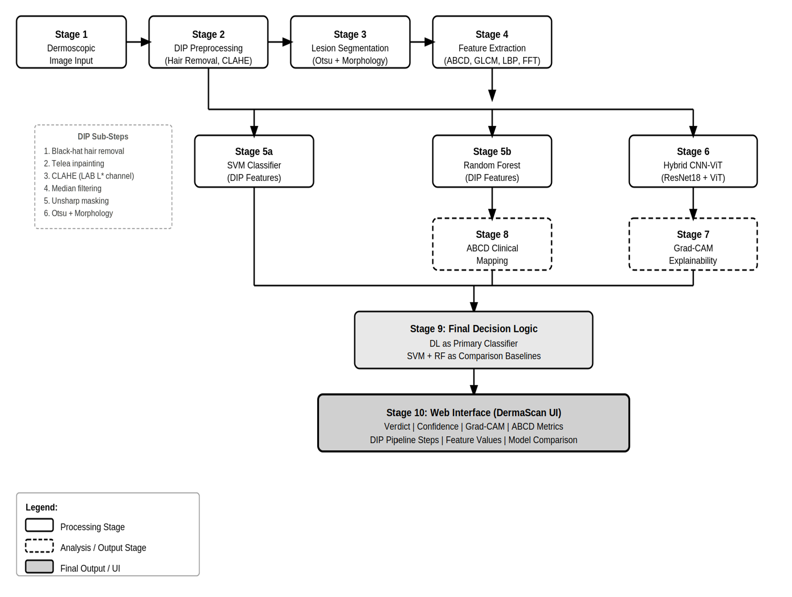
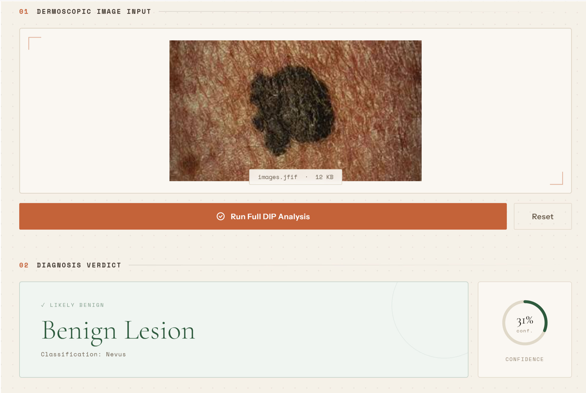
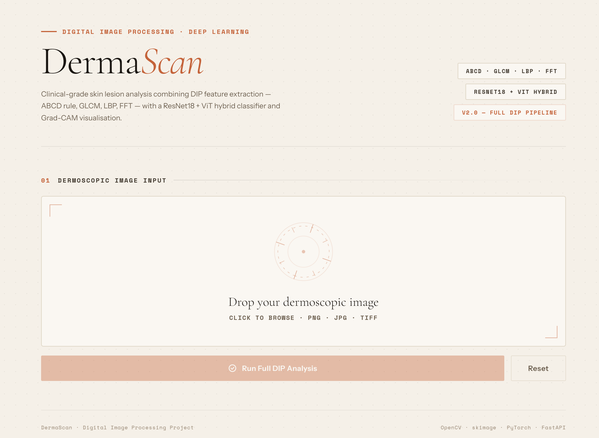
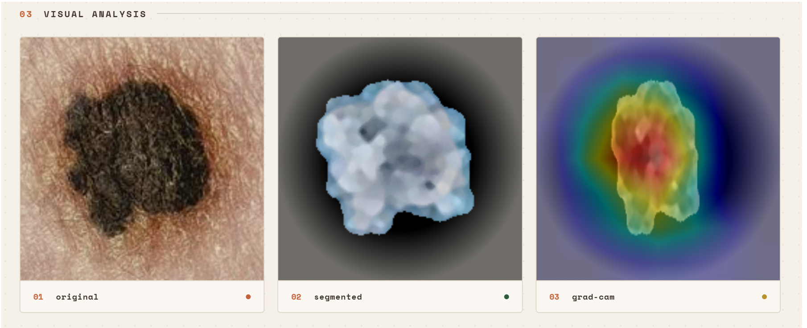

# DermaScan — Hybrid CNN-ViT Framework for Explainable Skin Lesion Analysis

DermaScan is an end-to-end AI-assisted dermoscopic image analysis system that combines classical Digital Image Processing (DIP), traditional Machine Learning, and a Hybrid CNN–Vision Transformer architecture for interpretable skin lesion classification.

The system integrates:
- Hair removal + contrast enhancement preprocessing
- Otsu-based lesion segmentation
- DIP feature extraction aligned with ABCD dermatology criteria
- SVM and Random Forest baselines
- Hybrid ResNet18 + Vision Transformer deep learning model
- Grad-CAM explainability
- Interactive web-based diagnostic dashboard

---

## Features

### Digital Image Processing Pipeline
- Morphological black-hat hair removal
- TELEA inpainting reconstruction
- CLAHE contrast enhancement in LAB color space
- Median filtering + unsharp masking
- Otsu threshold segmentation
- Morphological refinement + Largest Connected Component extraction

### Feature Extraction
- ABCD clinical criteria mapping
- Shape descriptors
- GLCM texture features
- LBP microtexture analysis
- FFT frequency-domain features

### Machine Learning
- SVM (RBF kernel)
- Random Forest classifier

### Deep Learning
- Hybrid ResNet18 + Vision Transformer architecture
- Local + global feature fusion
- Grad-CAM explainability

### Web Interface
- Interactive diagnostic report
- Segmentation visualization
- Grad-CAM heatmaps
- Multi-model comparison dashboard

---

# System Architecture



---

# Demo

## Input Upload


## Diagnosis Dashboard


## Grad-CAM Visualization


---

# Experimental Results

| Model | Accuracy | AUC |
|---|---|---|
| SVM | 72.3% | 0.74 |
| Random Forest | 74.8% | 0.78 |
| ResNet18 | 79.1% | 0.83 |
| ViT | 76.4% | 0.80 |
| Hybrid CNN-ViT | **83.7%** | **0.88** |

### Segmentation Improvement
- Dice Score Improvement: **+12.2%**
- IoU Improvement: **+13.7%**

---

# Performance

| Metric | Value |
|---|---|
| Avg Inference Time | ~120ms/image (CPU) |
| Framework | PyTorch 2.0 |
| GPU Used During Training | RTX 3060 |
| Input Resolution | 224×224 |

---

# Tech Stack

## Frontend
- HTML/CSS/JavaScript
- React-style component architecture

## Backend
- Flask
- OpenCV
- scikit-learn
- PyTorch
- timm

## Deep Learning
- ResNet18
- Vision Transformer (ViT)

---

# Project Structure

```bash
dermascan/
│
├── frontend/
├── backend/
│   ├── app.py
│   ├── dip_model.py
│   └── models/
│
├── screenshots/
├── Dockerfile
├── requirements.txt
└── README.md
```

---

# Running Locally

## Clone Repository

```bash
git clone https://github.com/yourusername/dermascan.git
cd dermascan
```

## Install Dependencies

```bash
pip install -r requirements.txt
```

## Run Backend

```bash
python app.py
```

Backend runs on:
```bash
http://127.0.0.1:5000
```

---

# Azure Deployment

This project is containerized using Docker and deployable on:
- Azure App Service
- Azure Container Registry
- Azure Static Web Apps

---

# Dataset

- ISIC Dermoscopy Archive
- Stratified subset (~3200 images)
- 70/15/15 train-validation-test split

---

# Limitations

- Moderate dataset size
- Otsu segmentation struggles under uneven illumination
- Hybrid CNN-ViT introduces higher inference cost
- Not clinically validated

---

# Future Work

- Transformer-based segmentation (TransUNet / Swin-UNet)
- Expanded ISIC 2019/2020 training
- Fairness-aware augmentation
- SHAP explainability
- Clinical validation studies

---

# Research Paper

Full project paper included in repository:
- `DermaScan.pdf`

---

# ⚠️ Disclaimer

This project is intended for academic and research purposes only and does not provide medical advice or diagnosis.
